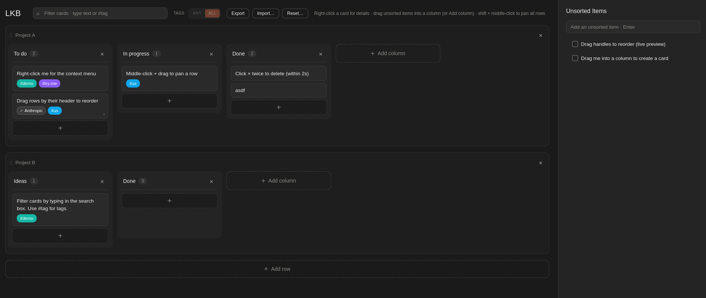

# Local Kanban (LKB)

**Try it:** open [`index.html`](index.html) in a current desktop or mobile browser.  
For **installable PWA** behavior and the **service worker**, serve this folder over **`http://localhost`** or **HTTPS** (browsers restrict or disable workers on `file://`).

## What it is

**Local Kanban** is a **single-page** kanban: horizontal **rows** (swimlanes), each with **columns** and **cards**, plus an **Unsorted** inbox on the side. Nothing is sent to a server-your board is saved in the browser with **`localStorage`** (`kanbanState`), so it comes back when you reopen the same origin.

Good fit when you want a **fast, private** board without accounts, sync, or another SaaS subscription.

## Features

- **Board** - Drag **row** and **column** headers to reorder. Add rows and columns from the board. Middle‑click (or trackpad) drag to **pan** a row’s board; **Shift + middle‑click** pans all rows together.
- **Cards** - Drag between columns; **right‑click** for description, structured links, **#tags**, demote to Unsorted, or delete. **Search** filters by words and `#tags` (match **any** or **all** tags when you use several).
- **Unsorted** - Stash lines before they become cards; drag a line into a column to **promote** it to a card. **URLs in text** are clickable and open in a new tab.
- **Header tools** - **Export** JSON backup; **Import** merges a file into the current board (new IDs so nothing collides); **Reset** clears everything with a confirmation step.
- **PWA** - Web app manifest and a minimal service worker when served over HTTP(S); [`icon.svg`](icon.svg) is used for the tab / install icon.

## Why use it

- **Yours only** - Data stays on your device unless you export it.
- **No friction** - No sign‑up, no loading spinners from a remote API.
- **Portable** - One `index.html` you can drop on static hosting or keep on disk; JSON export for backups and moves between machines.
- **Open source** - Change behavior or styling however you like.

## Offline and install

After one successful visit while **online** (with the app served over HTTP(S)), browsers that support it can **install** or **add to home screen** like other PWAs. Offline behavior depends on the browser and how the site is hosted; the bundled worker is intentionally small-treat **Export** as your real long‑term backup.

## AI disclosure

Parts of this project (including UI and README text) were produced or refined with **AI coding assistants**. You should still review behavior and data handling for anything safety‑ or privacy‑critical.
